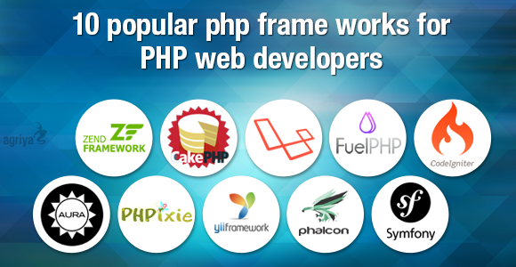
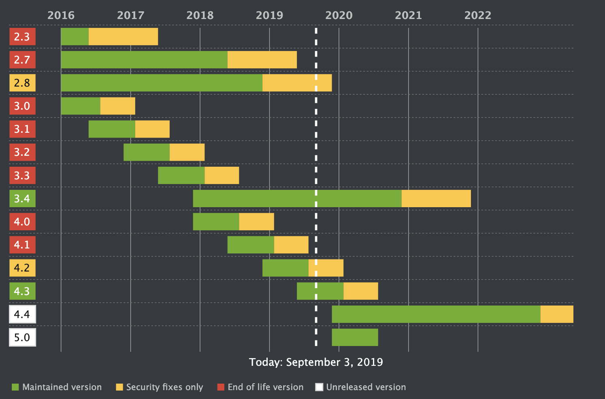

# Introduction

## Présentation

Découvrir et appréhender un framework PHP web.

## Pré-requis

* PHP
* Programmation Orientée Objet
* Structure MVC
* Base de données

## Organisation

* 20 heures de TD
* 12 heures de TP
* Notes :
  * 1 évaluation écrite \(dernier TD\)
  * 1 note pratique \(lors du dernier TP\)

## Rappels des concepts du MVC


### C: Controller / Contrôleur

C'est lui qui reçoit l'interaction \(la demande/**request**\) du visiteur. Il se charge de récupérer les éléments nécessaires auprès du/des modèle\(s\). Il transmets toutes les données nécessaires à la vue.

### V: View / Vue

C'est lui qui apporte la réponse \(**response/render**\) au visiteur. Une vue peut être une page web, un fichier pdf, ... Ne se préoccupe que de l'affiche des informations, n'assure aucun traitement

### M: Model / Modèle

C'est lui qui s'occupe de récupérer et préparer les données. Le modèle peut être en lien avec une base de données. Le modèle peut être en lien avec des API. Le modèle prépare les données pour qu'elles soient facilement manipulables par la vue.

## Notion de Framework

### Définition générale

En programmation informatique, un framework ou structure logicielle est un ensemble cohérent de composants logiciels structurels, qui sert à créer les fondations ainsi que les grandes lignes de tout ou d’une partie d’un logiciel \(architecture\). Un framework se distingue d’une simple bibliothèque logicielle principalement par :

* son caractère générique, 
* faiblement spécialisé, 
* contrairement à certaines bibliothèques ; 

Un framework peut à ce titre être constitué de plusieurs bibliothèques chacune spécialisée dans un domaine. Un framework peut néanmoins être spécialisé, sur un langage particulier, une plateforme spécifique, un domaine particulier : reporting, mapping, etc. ;

Le cadre de travail \(traduction littérale de l’anglais : _framework_\) qu’il impose de par sa construction même, guidant l’architecture logicielle voire conduisant le développeur à respecter certains patterns \(modèle de conception\) ; les bibliothèques le constituant sont alors organisées selon le même paradigme.

### Framework Orienté Objet

Un framework dit orienté objet est typiquement composé de classes mères qui seront dérivées et étendues par héritage en fonction des besoins spécifiques à chaque logiciel qui utilise le framework.

Le développeur qui utilise le framework pourra personnaliser les éléments principaux du framework par extension, en utilisant le **mécanisme d’héritage** : créer des nouvelles classes qui contiennent toutes les fonctionnalités que met en place le framework, et en plus ses fonctionnalités propres, créées par le développeur en fonction des besoins spécifiques à son application.

<table>
  <thead>
    <tr>
      <th style="text-align:left">Avantages</th>
      <th style="text-align:left">Inconv&#xE9;nients</th>
    </tr>
  </thead>
  <tbody>
    <tr>
      <td style="text-align:left">
        <p></p>
        <ul>
          <li>Pour e&#x301;viter des erreurs dans l&#x2019;organisation des appels</li>
          <li>E&#x301;viter les appels directs aux commandes PHP</li>
          <li>Pre&#x301;fe&#x301;rer les versions des Frameworks qui apportent leur
            lot de contro&#x302;les.</li>
          <li>Plus grand portabilite&#x301; du code</li>
          <li>Ne pas re&#x301;inventer la roue</li>
          <li>La gestion des formulaire, des utilisateurs, ...</li>
        </ul>
      </td>
      <td style="text-align:left">
        <p></p>
        <ul>
          <li>Apprentissage d&#x2019;une couche supple&#x301;mentaire</li>
          <li>La majorite&#x301; des fonctionnalite&#x301;s PHP sont rede&#x301;finies</li>
          <li>Ge&#x301;ne&#x301;ralement apprentissage d&#x2019;un moteur de template</li>
          <li>Apprentissage de l&#x2019;utilisation du framework choisit : ses classes,
            ses objets, sa logique !</li>
        </ul>
      </td>
    </tr>
  </tbody>
</table>

Article comparatifs des 10 frameworks PHP les plus populaires de 2019: [https://coderseye.com/best-php-frameworks-for-web-developers/](https://coderseye.com/best-php-frameworks-for-web-developers/)

## Symfony


* Framework MVC en PHP 5 \(V2\) et PHP 7 \(V3 et V4\), libre
* Développé en 2005 par la société Sensio pour répondre à ses besoins
* Division de la société Sensio en deux entités l’agence Web et l’entreprise qui soutient et maintient Symfony : SensioLabs, dirigée par Fabien Potencier, l’auteur de Symfony
* Framework français !, De renommée mondiale
* Premier framework en France et en Europe

### SYMFONY : AVANTAGES

* Connectable à presque tous les SGBD
* De nombreux Bundles, contributeurs, utilisateurs
* Moteur de template puissant et simple
* Depuis la V4, Symfony est très léger et très rapide



### Symfony V4 : Un retour aux bases

Avec sa version 4 \(et suivante\), Symfony à pris un virage important par rapport aux précédentes versions, et se rapproche des "standards" de la majorité des framework, mais à aussi grandement optimisé son poids et sa vitesse d'exécution. Dans une grande logique de simplification Symfony à également automatisé de nombreux mécanismes qui auparavant auraient impliqués de nombreuses lignes de configuration.

#### SKELETON ET FLEX

La version **Skeleton** de Symfony : Apporte un framework Symfony très léger, avec le minimum pour faire fonctionner un controller.

La version 4 de Symfony introduit Flex qui est un gestionnaire de "recipes" \(recettes\), qui permet l'ajout de fonctionnalité à Symfony \(gestionnaire de vue, de base de données, d'email, ...\) avec un mécanisme d'auto-configuration de ces "bundles". Cela permet donc de fournir par défaut un framework très léger, avec une grande facilité pour lui ajouter tous les composants nécessaires, sans en mettre plus que nécessaire.

Par défaut Symfony version Skeleton ne sais rien faire ! Par contre, il n'embarque pas des dizaines de Bundles dont vous n'aurez peut être jamais besoin \(fonctionnement des versions 2 et 3 avec plus de 46 bundles par défaut, contre 10 aujourd'hui\).

Grâce à Flex vous installez rapidement le nécessaire pour répondre à votre projet.

###  Symfony V5 : Continuer vers la simplification et la standardisation <a id="symfony-v4-un-retour-aux-bases"></a>

Avec sa version 5 \(et suivante\), Symfony continue sa simplification en facilitant l'usage de nombreux composants redéfinis et devenus génériques.


Une lecture intéressante sur la logique d'évolution du framework Symfony : [https://www.disko.fr/reflexions/technique/symfony-4-4-5-0-les-nouveautes-venir/](https://www.disko.fr/reflexions/technique/symfony-4-4-5-0-les-nouveautes-venir/)


## Installations

### Configuration requise pour votre serveur

* Un serveur Web
* PHP 7.2.5 ou supérieur
* [Git \(différent de GitHub\)](https://git-scm.com/)
* Le gestionnaire de dépendance [Composer](https://getcomposer.org/)
* Le nouveau gestionnaire d'installation de Symfony : [https://symfony.com/download](https://symfony.com/download)
* Une maîtrise de son système d'exploitation ! \(fichiers cachés, variables PATH, php.ini, console...\)

## Exercice 1 : Installation des outils

* [ ] Installer un serveur local \(si ce n'est pas déjà fait\)
* [ ] Installer [Git](https://git-scm.com/)
* [ ] Installer [Composer](https://getcomposer.org/)
* [ ] Installer l'utilisateur [Symfony](https://symfony.com/download)
* [ ] Pour les utilisateurs de Windows : Installer une vraie console ! [https://cmder.net/](https://cmder.net/) par exemple.
* [ ] Installer un vraie IDE ! \([PhpStorm](https://www.jetbrains.com/phpstorm/) / NetBeans, ou éventuellement [VSCode](https://code.visualstudio.com/)\).

Pensez à vérifier que tout fonctionne correctement :

```text
php -v
composer -v
symfony -v
git -v
```

Vous devez vous afficher les numéros de version. **Corrigez les messages d'erreurs éventuels.**


Vous pouvez tester si votre système est prêt à installer Symfony :

`symfony check:requirements`


## Exercice 2 : Installation de Symfony.

Symfony propose deux versions :

* La version **skeleton**, la plus minimaliste et légère, qui n'installe que le stricte minimum, vous laissant ainsi la liberté d'ajouter les composants dont vous avez réellement besoin. Avec cette solution vous pouvez développer des API, des micro-services,  ou une application en console
* Le version **website-skeleton**, qui va installer tout le nécessaire pour faire fonctionner un site \(vues, annotations, base de données, ...\)

On va privilégier la version **skeleton**.

Placez-vous dans le répertoire où vous souhaitez installer Symfony \(www, public\_html, ...\) et exécutez la commande suivante \(cela va créer un répertoire du nom de votre projet\).

```text
symfony new nomDuProjet

#ou avec Composer
 composer create-project symfony/skeleton nomDuProjet

```

Par défaut cette commande récupère la dernière version stable de Symfony. Le téléchargement peut prendre quelques minutes.

Il est possible de tester immédiatement le bon fonctionnement de l'installation en utilisant la ligne de commande intégrée dans l'utilitaire Symfony :

```text
cd nomDuProjet
 symfony server:start
```

Si vous vous rendez sur l'URL [http://localhost:8000/](http://localhost:8000/) vous devriez voir la page d'accueil de Symfony avec le numéro de la version installée..


Symfony embarque \(et installe\) un serveur Web très puissant qui permet de tester le fonctionnement d'un site. Il est possible de gérer les url sécurisées \(https\), la simulation d'un domaine, ...


